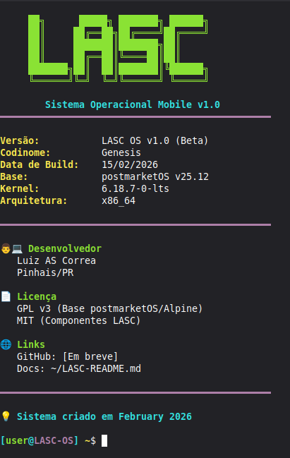
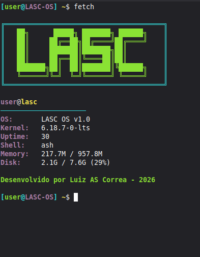
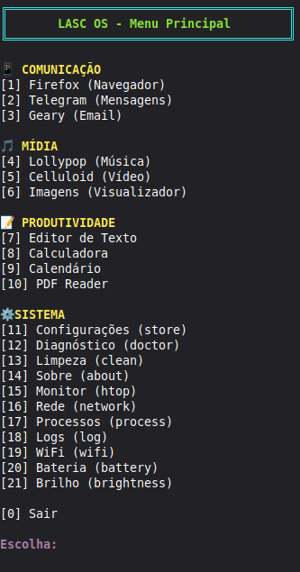
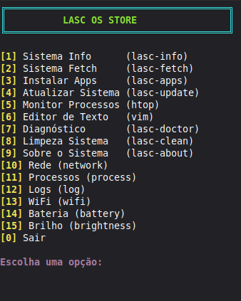
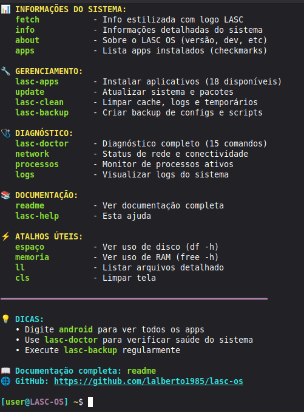
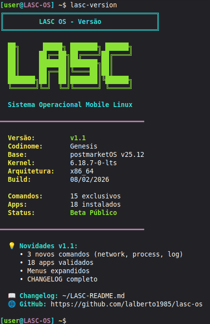

# LASC OS - Sistema Operacional Mobile Linux


Sistema Operacional Mobile Linux completo, baseado em postmarketOS, com interface Android-style e 23 comandos exclusivos.

**Privacidade • Liberdade • Controle**

---

## 🎯 Sobre o LASC OS

LASC OS é um sistema operacional mobile Linux desenvolvido do zero, focado em:
- **Privacidade**: Sem rastreamento, sem telemetria
- **Liberdade**: 100% open source, você controla tudo
- **Personalização**: 8 temas visuais, comandos customizáveis

Baseado em postmarketOS (Alpine Linux), oferece uma experiência mobile completa via terminal e interface gráfica Phosh.

---

## ✨ Features

### 🚀 Sistema Completo
- **23 comandos exclusivos** desenvolvidos do zero
- **18 aplicativos** instalados (Firefox, Telegram, Git, Python, etc)
- **Dashboard automático** no login
- **Launcher Android-style** com 21 opções
- **Store Hub** com 15 ferramentas

### 📱 Mobile Ready
- ✅ **WiFi Manager** - Gerenciador completo de redes
- ✅ **Battery Monitor** - Monitor de bateria com alertas
- ✅ **Brightness Control** - Controle de brilho interativo
- ✅ **Network Status** - Status de rede em tempo real
- ✅ **Process Manager** - Gerenciador de processos

### 🎨 Personalização

# LASC OS

### Sistema Operacional Mobile Linux — Open Source

[](https://github.com/lalberto1985/lasc-os/releases)
[](LICENSE)
[](https://postmarketos.org)
[](#comandos-exclusivos)
[](#apps-instalados)
[](docs/INSTALLATION.md)
[](#)

**Privacidade • Liberdade • Controle**

[Instalação](docs/INSTALLATION.md) · [Documentação](docs/) · [Roadmap](docs/ROADMAP.md) · [Contribuir](docs/CONTRIBUTING.md) · [Changelog](docs/CHANGELOG.md)

</div>

---

## Sobre o LASC OS

LASC OS é um sistema operacional mobile Linux desenvolvido do zero, focado em privacidade, liberdade e personalização. Baseado em **postmarketOS** (Alpine Linux), oferece uma experiência mobile completa via terminal e interface gráfica **Phosh**.

- **Privacidade** — Sem rastreamento, sem telemetria, você controla seus dados
- **Liberdade** — 100% open source, totalmente auditável
- **Personalização** — 8 temas visuais, 23 comandos exclusivos, aliases configuráveis

---

## Features

### Sistema Completo
- 23 comandos exclusivos desenvolvidos do zero
- 18 aplicativos instalados (Firefox, Telegram, Git, Python, e mais)
- Dashboard automático exibido no login
- Launcher Android-style com 21 opções
- Store Hub com 15 ferramentas integradas

### Mobile Ready
- **WiFi Manager** — Gerenciamento completo de redes sem fio
- **Battery Monitor** — Monitor de bateria com alertas e barra visual
- **Brightness Control** — Controle de brilho com presets e ajuste fino
- **Network Status** — Diagnóstico de rede em tempo real
- **Process Manager** — Gerenciamento de processos do sistema

### Personalização
- 8 Temas Visuais: Default, Hacker, Candy, Ocean, Fire, Ice, Sunset, Forest
- 30 Frases Motivacionais diárias aleatórias
- 10 ASCII Arts personalizáveis
- 22+ aliases configuráveis no shell

---

## Screenshots

| Dashboard | Fetch | Android Launcher |
|-----------|-------|-----------------|
|  |  |  |

| Store | Help | Version |
|-------|------|---------|
|  |  |  |

---

## Estrutura do Repositório

```
lasc-os/
├── docs/
│   ├── CHANGELOG.md        # Histórico de versões
│   ├── CONTRIBUTING.md     # Guia de contribuição
│   ├── INSTALLATION.md     # Instruções de instalação
│   ├── ROADMAP.md          # Planejamento de versões futuras
│   └── TROUBLESHOOTING.md  # Solução de problemas
├── scripts/
│   └── install.sh          # Instalador automático
├── screenshots/            # Screenshots do sistema (12 imagens)
├── .gitignore
├── LICENSE
└── README.md
```

---

## Comandos Exclusivos (23)

### Core — v1.0.0

| Comando | Função |
|---------|--------|
| `lasc-dashboard` | Dashboard automático com status do sistema |
| `lasc-fetch` | Informações estilizadas com logo ASCII |
| `lasc-info` | Informações detalhadas do sistema |
| `lasc-apps` | Instalador de 18 aplicativos |
| `lasc-update` | Atualizador de sistema |
| `lasc-store` | Hub com 15 ferramentas |
| `lasc-android` | Launcher mobile com 21 opções |
| `lasc-list` | Lista apps instalados |
| `lasc-clean` | Limpeza de sistema |
| `lasc-doctor` | Diagnóstico completo (valida todos os 23 comandos) |
| `lasc-about` | Sobre o sistema |
| `lasc-backup` | Sistema de backup |

### Sistema — v1.1.0

| Comando | Função |
|---------|--------|
| `lasc-network` | Status de rede completo |
| `lasc-process` | Monitor de processos |
| `lasc-log` | Visualizador de logs do sistema |

### Usabilidade — v1.1.1

| Comando | Função |
|---------|--------|
| `lasc-help` | Central de ajuda completa |
| `lasc-version` | Informações de versão e novidades |

### Visual — v1.2.0 a v1.4.0

| Comando | Função |
|---------|--------|
| `lasc-theme` | Sistema de temas (8 opções) |
| `lasc-quote` | Frases motivacionais (30 frases) |
| `lasc-ascii` | Gerador de arte ASCII (10 palavras) |

### Mobile — v1.3.0

| Comando | Função |
|---------|--------|
| `lasc-wifi` | Gerenciador WiFi completo |
| `lasc-battery` | Monitor de bateria |
| `lasc-brightness` | Controle de brilho |

---

## Apps Instalados (18)

| Categoria | Apps |
|-----------|------|
| Comunicação | Firefox ESR, Telegram Desktop, Geary |
| Mídia | Lollypop, Celluloid, Eye of GNOME |
| Produtividade | Text Editor, Calculator, Calendar, Contacts, Clocks, Weather, Evince |
| Desenvolvimento | Git 2.52.0, Python 3.12.12, Node.js, Vim, Htop |

---

## Instalação

Consulte o guia completo em **[docs/INSTALLATION.md](docs/INSTALLATION.md)**.

### Início Rápido (via script)

```bash
git clone https://github.com/lalberto1985/lasc-os.git
cd lasc-os
bash scripts/install.sh
```

### Instalação Manual

```bash
# 1. Clone o repositório
git clone https://github.com/lalberto1985/lasc-os.git
cd lasc-os

# 2. Extraia os componentes do sistema
sudo tar -xzf backups/lasc_scripts_*.tar.gz -C /
tar -xzf backups/lasc_backup_*.tar.gz -C ~/

# 3. Recarregue o ambiente
source ~/.profile

# 4. Valide a instalação
lasc-doctor
```

---

## Documentação

| Documento | Descrição |
|-----------|-----------|
| [INSTALLATION.md](docs/INSTALLATION.md) | Métodos de instalação detalhados |
| [CHANGELOG.md](docs/CHANGELOG.md) | Histórico de todas as versões |
| [ROADMAP.md](docs/ROADMAP.md) | Planos para versões futuras |
| [CONTRIBUTING.md](docs/CONTRIBUTING.md) | Como contribuir com o projeto |
| [TROUBLESHOOTING.md](docs/TROUBLESHOOTING.md) | Solução de problemas comuns |

---

## Contribuindo

Contribuições são bem-vindas! Veja o guia em [docs/CONTRIBUTING.md](docs/CONTRIBUTING.md).

1. Faça um fork do repositório
2. Crie uma branch: `git checkout -b feature/MinhaFeature`
3. Commit suas mudanças: `git commit -m 'feat: adiciona MinhaFeature'`
4. Push para a branch: `git push origin feature/MinhaFeature`
5. Abra um Pull Request

---

## Licença

Distribuído sob as licenças **MIT** e **GPL v3**. Veja o arquivo [LICENSE](LICENSE) para mais detalhes.

---

<div align="center">

**LASC OS** — *Privacidade, Liberdade, Controle* 🚀

Desenvolvido com ❤️ no Brasil 🇧🇷

</div>
