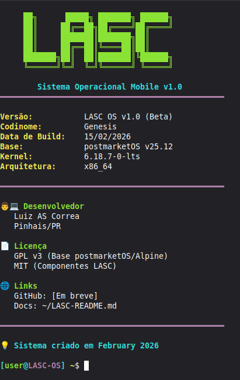
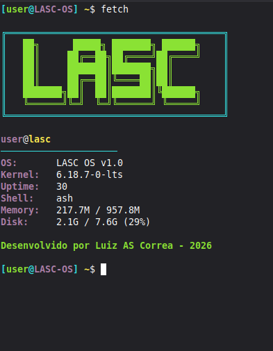
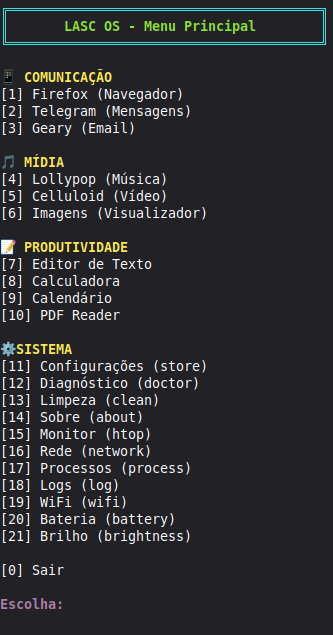
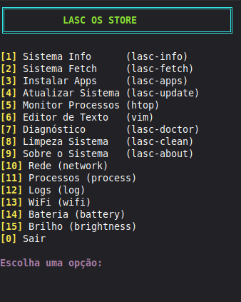
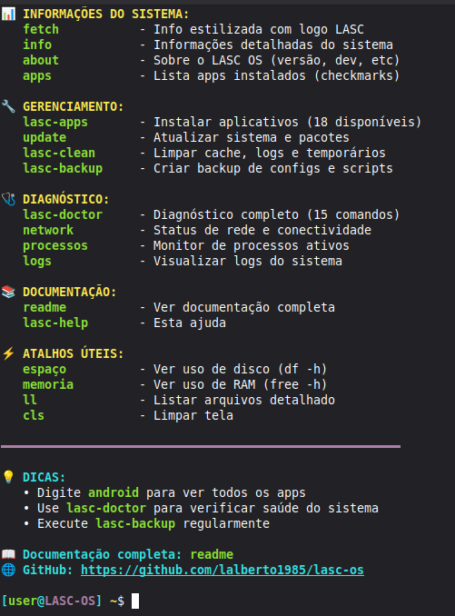
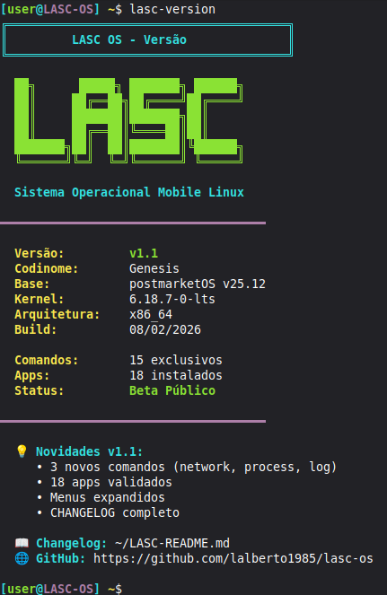

# LASC OS

**Sistema Operacional Mobile Linux — Foundation 1.5.0**

**Privacidade • Liberdade • Controle**

LASC OS é um projeto de experiência mobile Linux baseado em
**postmarketOS**, **Alpine Linux** e no ecossistema Linux mobile.

A versão **1.5.0-dev** está focada na fundação técnica do projeto:
estrutura de código versionada, comandos consistentes, bibliotecas
compartilhadas, instalação segura, empacotamento APK e validação
automática.

> A Foundation 1.5.0 ainda é uma versão de desenvolvimento.
> Recursos de hardware, distribuição pública de pacotes e integrações
> futuras são tratados separadamente no roadmap.

---

## Estado atual

A Foundation possui atualmente:

- 17 comandos `lasc-*`;
- 3 bibliotecas compartilhadas;
- shell compatível com POSIX `sh`;
- pacote Alpine `lasc-os`;
- subpacote de documentação `lasc-os-doc`;
- instalador de desenvolvimento a partir do código-fonte;
- testes automatizados;
- validação contínua no GitHub Actions.

O runtime utiliza:

~~~text
/usr/bin/lasc-*
/usr/lib/lasc-os/
/usr/share/lasc-os/
/usr/share/doc/lasc-os/
/usr/share/licenses/lasc-os/
~~~

---

## Comandos

### Sistema

| Comando | Função |
|---------|--------|
| `lasc-info` | Informações detalhadas do sistema |
| `lasc-fetch` | Resumo visual do LASC OS |
| `lasc-dashboard` | Painel geral de recursos do sistema |
| `lasc-doctor` | Diagnóstico de integridade e dependências |
| `lasc-network` | Diagnóstico e informações de rede |
| `lasc-process` | Monitor de processos do sistema |
| `lasc-log` | Visualizador dos logs recentes |

### Manutenção

| Comando | Função |
|---------|--------|
| `lasc-apps` | Instalador de aplicativos |
| `lasc-update` | Atualização de pacotes do sistema |
| `lasc-clean` | Limpeza segura de cache, temporários LASC e logs |
| `lasc-backup` | Backup de configurações e arquivos do LASC OS |

### Interface e utilitários

| Comando | Função |
|---------|--------|
| `lasc-android` | Menu principal e launcher do LASC OS |
| `lasc-store` | Central de ferramentas e manutenção |
| `lasc-list` | Lista e verifica aplicativos disponíveis |
| `lasc-about` | Informações institucionais do LASC OS |
| `lasc-version` | Versão, estado, codinome e novidades |
| `lasc-help` | Central de ajuda |

Para consultar a ajuda:

~~~sh
lasc-help
~~~

Para verificar o ambiente:

~~~sh
lasc-doctor
~~~

---

## Estrutura do projeto

~~~text
lasc-os/
├── src/
│   ├── bin/
│   └── lib/lasc/
├── packaging/
│   └── alpine/
│       └── APKBUILD
├── scripts/
│   └── install.sh
├── tests/
│   └── test-foundation.sh
├── docs/
├── screenshots/
├── VERSION
├── LICENSE
└── README.md
~~~

---

## Instalação de desenvolvimento

O script `scripts/install.sh` instala diretamente a árvore de código
do repositório usando o mesmo layout utilizado pelo pacote APK.

A instalação real é destinada a Alpine Linux/postmarketOS e requer
privilégios administrativos.

~~~sh
git clone https://github.com/lalberto1985/lasc-os.git
cd lasc-os

sudo ./scripts/install.sh
~~~

Depois da instalação:

~~~sh
lasc-version
lasc-doctor
~~~

O instalador não depende de backups históricos nem de extração manual
de tarballs.

### Teste sem alterar o sistema

O instalador também suporta `DESTDIR`, permitindo validar a instalação
em um diretório temporário:

~~~sh
DESTDIR=/tmp/lasc-root ./scripts/install.sh
~~~

Nesse modo nenhum arquivo é instalado no `/usr` real.

---

## Pacotes Alpine

O empacotamento Alpine está definido em:

~~~text
packaging/alpine/APKBUILD
~~~

Atualmente o processo produz:

~~~text
lasc-os
lasc-os-doc
~~~

O pacote principal contém o runtime:

~~~text
/usr/bin/lasc-*
/usr/lib/lasc-os/
/usr/share/lasc-os/VERSION
/usr/share/lasc-os/CHANGELOG.md
~~~

O subpacote `lasc-os-doc` contém:

~~~text
/usr/share/doc/lasc-os/README.md
/usr/share/licenses/lasc-os/LICENSE
~~~

Os APKs produzidos pela CI são utilizados atualmente para validar
construção, instalação e conteúdo dos pacotes.

Um repositório público de pacotes e uma infraestrutura permanente de
assinatura ainda não fazem parte desta etapa da Foundation.

---

## Testes

A suíte principal pode ser executada com:

~~~sh
./tests/test-foundation.sh
~~~

A validação atual cobre:

- estrutura dos 17 comandos;
- 3 bibliotecas compartilhadas;
- sintaxe POSIX shell;
- detecção de padrões legados ou perigosos;
- versão e central de ajuda;
- operações seguras de limpeza e backup;
- instalador utilizando `DESTDIR`;
- menus e cancelamento seguro.

As mesmas verificações são executadas automaticamente pela CI.

---

## Screenshots

| Dashboard | Fetch | Android |
|-----------|-------|---------|
|  |  |  |

| Store | Help | Version |
|-------|------|---------|
|  |  |  |

---

## Documentação

| Documento | Conteúdo |
|-----------|----------|
| [INSTALLATION.md](docs/INSTALLATION.md) | Instalação e preparação do ambiente |
| [CHANGELOG.md](docs/CHANGELOG.md) | Histórico de versões |
| [ROADMAP.md](docs/ROADMAP.md) | Planejamento do projeto |
| [CONTRIBUTING.md](docs/CONTRIBUTING.md) | Guia de contribuição |
| [TROUBLESHOOTING.md](docs/TROUBLESHOOTING.md) | Diagnóstico e solução de problemas |

Parte da documentação histórica ainda está sendo atualizada para refletir
a arquitetura da Foundation 1.5.0.

---

## Licença

As customizações, scripts e componentes próprios do LASC OS são
distribuídos sob a licença **MIT**. Consulte [LICENSE](LICENSE).

O projeto utiliza e integra componentes de projetos como Alpine Linux e
postmarketOS. Esses componentes mantêm suas respectivas licenças
originais.

---

## Projeto

**LASC OS**

Sistema Operacional Mobile Linux.

**Privacidade • Liberdade • Controle**
